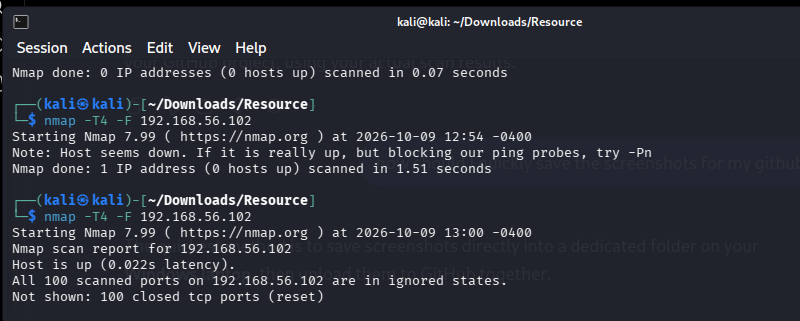
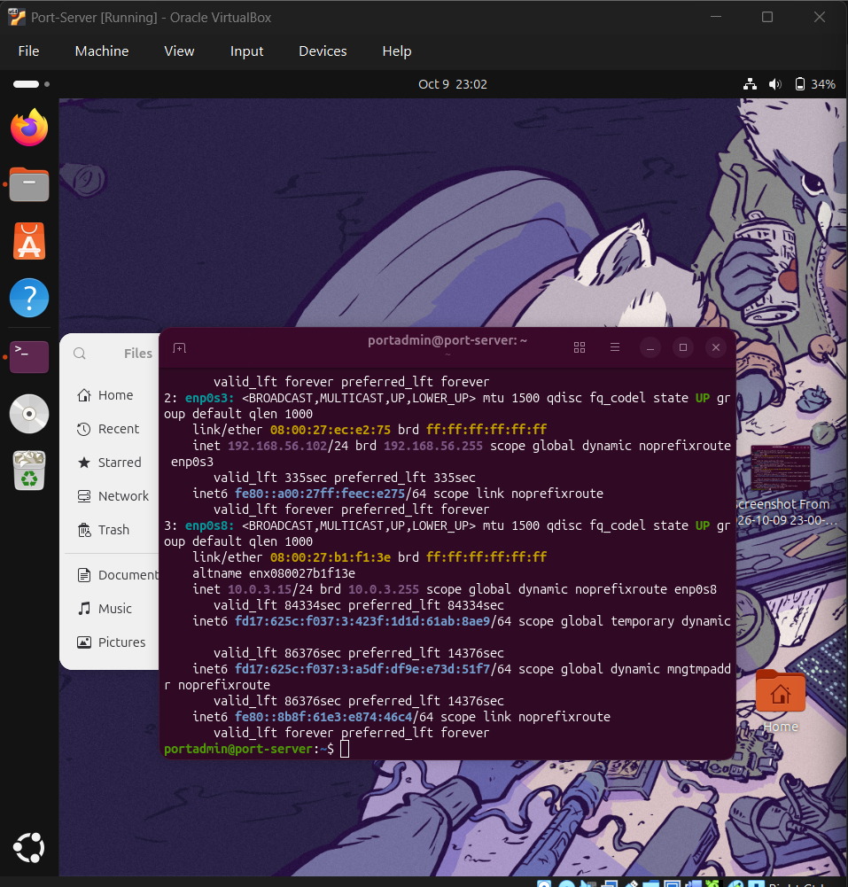

# 🔎 Network Scanning and Host Discovery with Nmap

## 1. Project Overview

This project explores network reconnaissance and host discovery using Nmap and Zenmap in a controlled virtual lab. The objective was to identify a target host, examine TCP port states, and understand how scan results help assess network exposure.

## 2. Lab Environment

| Component | Configuration |
|---|---|
| Scanner | Kali Linux |
| Target | Ubuntu virtual machine |
| Virtualization | Oracle VirtualBox |
| Scanner lab network | `192.168.56.0/24` |
| Scanner IP | `192.168.56.101` |
| Target IP | `192.168.56.102` |
| Tools | Nmap and Zenmap |

*These addresses describe the isolated lab configuration, not a production network.*

## 3. Objective

- Discover whether the target host is reachable.
- Perform a quick TCP port scan.
- Interpret open, closed, and filtered port states.
- Understand how host availability affects scan results.

## 4. Methodology

### Step 1: Identify the target

The Ubuntu virtual machine was assigned the lab address `192.168.56.102`. The scanner and target were connected to the same host-only virtual network.

### Step 2: Perform a quick scan

Command used:

```bash
nmap -T4 -F 192.168.56.102
```

Explanation:

- `nmap` launches the network scan.
- `-T4` selects a faster timing profile.
- `-F` scans a reduced list of commonly used TCP ports.
- `192.168.56.102` is the target lab address.

### Step 3: Review the results

The scan reported the target as up and examined 100 TCP ports. The results showed no open ports; the examined ports were reported as closed.

### Step 4: Compare host availability

When the Ubuntu virtual machine was powered off, the target was reported as down. This illustrated how host discovery affects the interpretation of scan results.

A host reported as down is not necessarily physically offline: host discovery probes may be blocked or unanswered by a firewall or network configuration.

## 📸 Scan Evidence

### Test 1: Port Administration VM powered OFF and ON



**Observation:** Nmap could not confirm that the target host was up. This is consistent with the VM being powered off, although blocked discovery probes can produce a similar result. The next command shows- the host as UP. 

### Seaport Administration VM powered on



**Observation:** Compare the host-discovery status and TCP port states with Test 1. The results should be interpreted from the actual scan output rather than assuming that the machine being powered on guarantees that it is reachable.


## 5. Findings

| Observation | Interpretation |
|---|---|
| Target reported as up | Host discovery succeeded during the scan. |
| 100 TCP ports examined | The quick scan checked a reduced set of common ports. |
| No open ports reported | No listening TCP services were identified on the scanned ports. |
| Ports reported as closed | The target responded in a way indicating that those ports were reachable but had no listening service. |
| Target reported down when VM was off | The scan could no longer confirm the host was available. |

## 6. What I Learned

- How to run a basic Nmap scan against a lab target.
- The difference between open, closed, and filtered port states.
- How virtual network configuration affects connectivity.
- Why a scan's scope matters when interpreting results.
- Why a host discovery failure does not conclusively prove a host is offline.

## 7. Limitations

- The scan examined only a reduced set of common TCP ports.
- The results do not establish that every port or service on the target is secure.
- A quick scan does not provide a complete vulnerability assessment.
- Results depend on the target's state and the virtual network configuration.

## 8. Future Improvements

- Compare quick scans with a full TCP port scan.
- Investigate service and version detection in the isolated lab.
- Capture and analyse scan traffic in Wireshark.
- Document additional results with screenshots and timestamps.

## 9. Ethical Considerations

All scanning was conducted against a virtual machine in a controlled lab environment. Network scanning should be performed only on systems for which appropriate authorization has been obtained.
