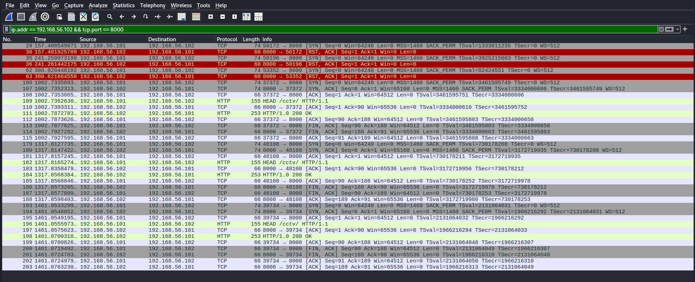

# 🦈 Wireshark Packet Analysis — HTTP Traffic

## 1. Project Overview

This project examines network traffic generated by an HTTP request from Kali Linux to a Python web server running on an Ubuntu virtual machine. Wireshark was used to inspect packets exchanged between the two systems.

## 2. Lab Environment

| Component | Details |
|---|---|
| Traffic analysis tool | Wireshark |
| Client / scanner | Kali Linux |
| Client IP | `192.168.56.101` |
| Server / target | Ubuntu Port Administration VM |
| Server IP | `192.168.56.102` |
| Transport protocol | TCP |
| Application protocol | HTTP |
| Server port | `8000` |
| Server software | Python SimpleHTTPServer |

## 3. Objective

- Capture traffic generated by an HTTP request.
- Identify the TCP connection establishment process.
- Apply Wireshark display filters to isolate relevant packets.
- Understand the relationship between TCP and HTTP.

## 4. Methodology

### Step 1: Start the web server

On Ubuntu, the following command started a Python HTTP server from the website directory:

```bash
python3 -m http.server 8000 --bind 0.0.0.0
```

The server reported that it was listening on port `8000`.

### Step 2: Generate HTTP traffic

From Kali Linux, the following command was executed:

```bash
curl -I http://192.168.56.102:8000/cctv/
```

### Step 3: Verify the HTTP response

The command returned:

```text
HTTP/1.0 200 OK
Server: SimpleHTTP/0.6 Python/3.14.4
Content-type: text/html
Content-Length: 2274
```

This confirmed that the client received a successful HTTP response from the server.

### Step 4: Filter traffic in Wireshark

The following display filter was used:

```text
ip.addr == 192.168.56.102 && tcp.port == 8000
```

This filter selects IP traffic involving the server address and TCP port 8000.

## 5. Observations

- The client successfully connected to the server.
- The server returned HTTP status `200 OK`.
- The response identified HTML content with a reported length of 2,274 bytes.
- The display filter isolated traffic relevant to the HTTP service.

The TCP handshake can be documented separately using the captured SYN, SYN-ACK, and ACK packets if they are present in the saved capture.


## 6. Packet-Level Analysis

### Failed TCP connection attempts

Several packets show TCP SYN requests from Kali Linux (`192.168.56.101`) to Ubuntu (`192.168.56.102`) on port `8000`. The server responds with RST, ACK packets.

This indicates that the connection attempts were refused at those moments, consistent with the absence of a listening service on the destination port.




### Successful TCP and HTTP communication

Later packets show the TCP three-way handshake:

1. SYN from Kali to Ubuntu.
2. SYN, ACK from Ubuntu to Kali.
3. ACK from Kali to Ubuntu.

The established connection carries an HTTP HEAD request for `/cctv/`, followed by an `HTTP/1.0 200 OK` response. Subsequent FIN, ACK packets indicate connection termination.

### Key Finding

The capture contains evidence of both refused TCP connection attempts and successful HTTP exchanges. This illustrates how Wireshark can help distinguish transport-layer connection failures from successful application-layer communication.

The capture does not, by itself, establish the exact cause of the earlier failures.


## 7. Key Learnings

- How to generate HTTP traffic in a controlled virtual lab.
- How to isolate traffic using Wireshark display filters.
- How TCP provides connection-oriented transport for HTTP.
- How HTTP response headers reveal status and content metadata.
- How packet captures support network troubleshooting.

## 8. Limitations

- The exercise covered one client, one server, and one HTTP endpoint.
- A successful HTTP response does not establish that the application is secure.
- Observations are limited to the packets captured during the test.
- The capture should be inspected for sensitive information before public release.

## 9. Ethical Considerations

The exercise was conducted in a controlled virtual lab using systems under my control. Packet capture and analysis should be performed only on networks for which appropriate authorization has been obtained.
